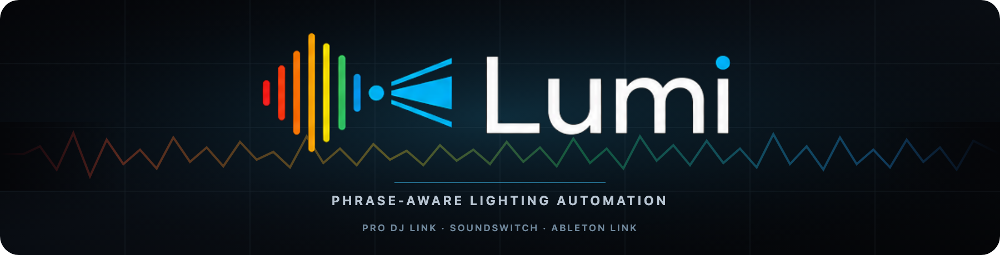
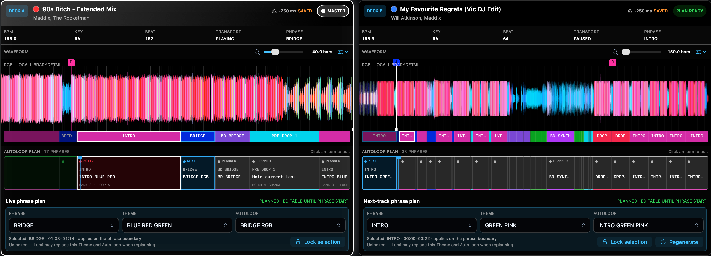
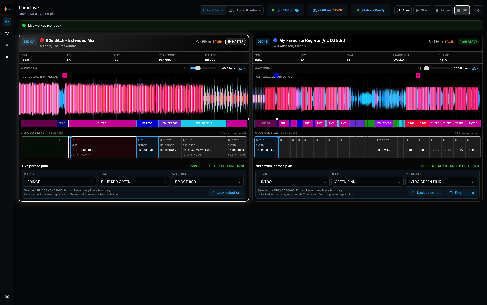
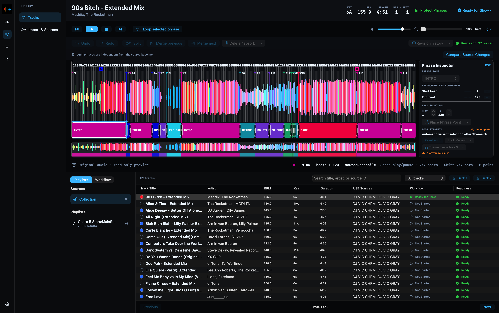
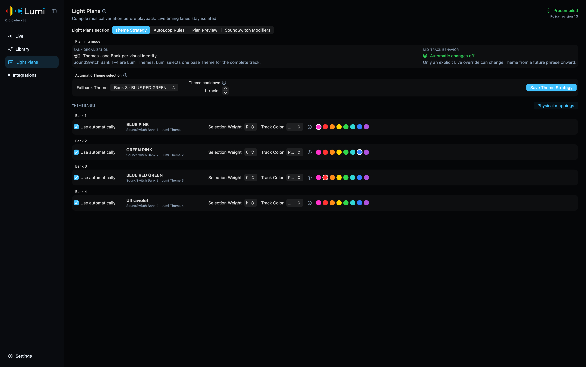
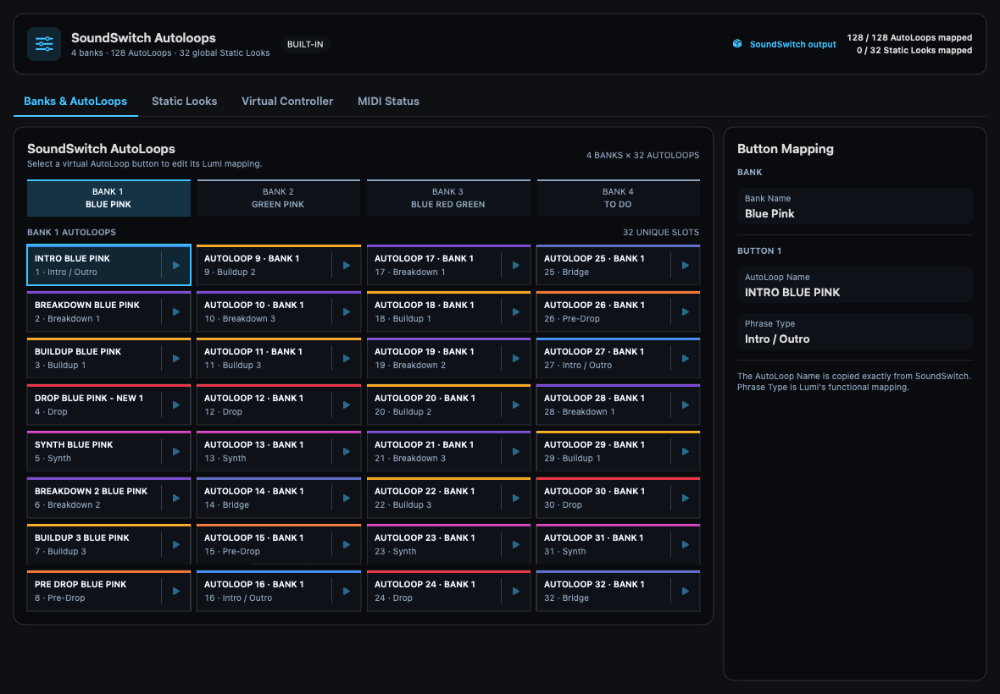
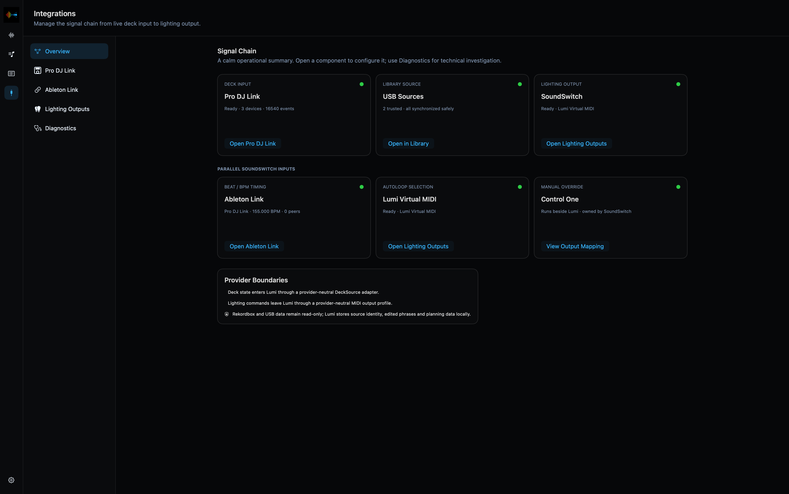
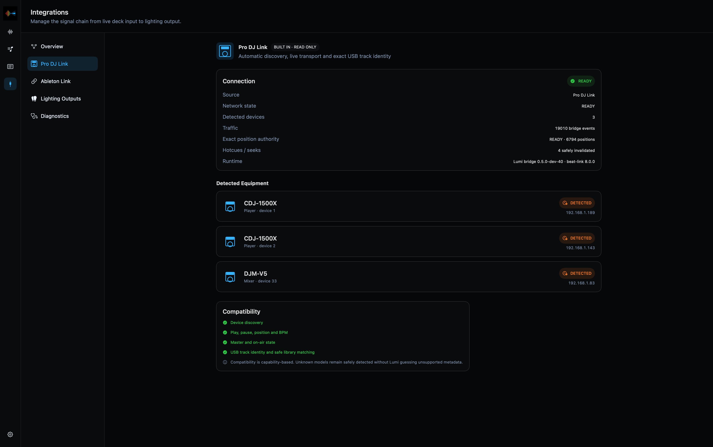
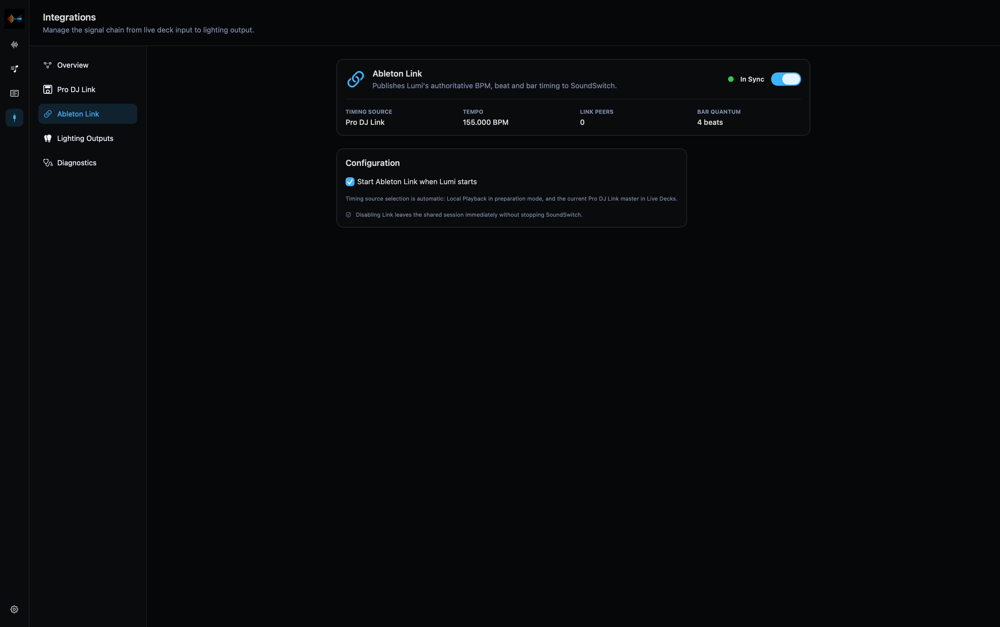
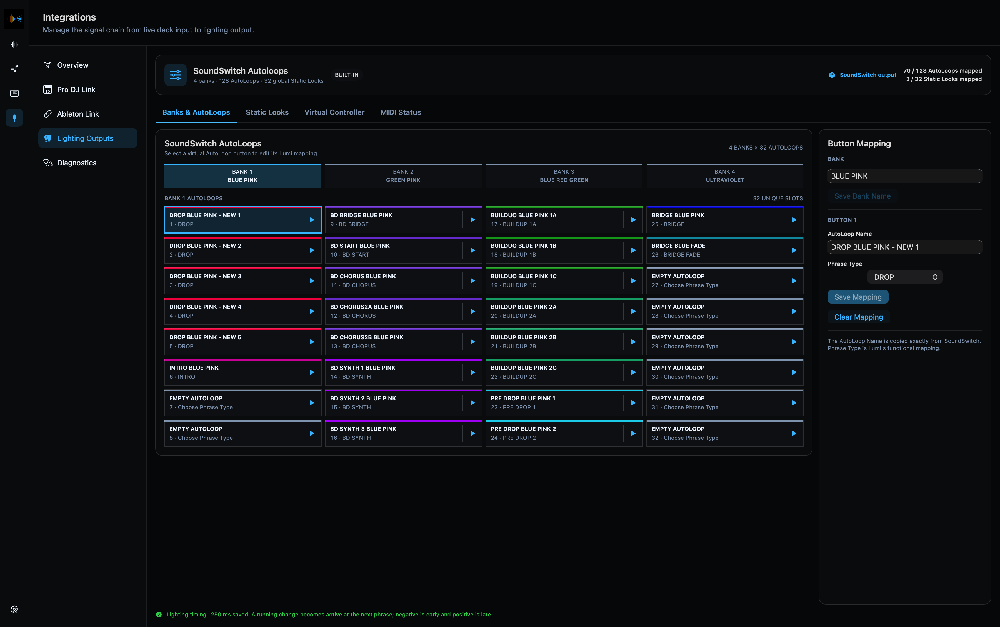

<p align="center">
  
</p>

<p align="center">
  Focus on DJ-ing... Let Lumi run the lights.
</p>

<p align="center">
  <strong>Public Beta</strong> · Field testing on different DJ and lighting setups is welcome
</p>

<p align="center">
  <a href="https://github.com/victorblanco-tech/lumi/releases">Download</a>
  ·
  <a href="docs/user-guide/README.md">User guide</a>
  ·
  <a href="docs/user-guide/iphone-remote.md">iPhone Remote</a>
  ·
  <a href="https://github.com/victorblanco-tech/lumi/issues">Report an issue</a>
</p>

Lumi prepares the lighting for the track that is playing and the track that is
coming next. It combines your own phrase structure realtime with the beatgrid
and deck state from the Pioneer DJ / AlphaTheta ecosystem, then triggers the
right SoundSwitch AutoLoop at the right moment.

The complete show runs locally on your Mac. SoundSwitch remains responsible for
fixtures and DMX output; Lumi acts like a virtual lighting operator beside your
normal controller.

**Take Live Decks into the booth with Lumi Remote for iPhone.** Follow the
current Master and next Player, monitor all three integrations and adjust a
future Theme or AutoLoop without returning to the Mac.



## Lumi Remote for iPhone

Lumi Remote brings the show-critical part of Live Decks into the booth. It
shows the numbered Players, vivid RGB waveforms, Hot Cues, phrases and Light
Plans from the authoritative Mac engine. From the phone you can change
`Off`, `Arm`, `Start` and `Pause`, control Ableton Link and timing offset, and
adjust a future Theme or AutoLoop without leaving the mixer.

<p align="center">
  
</p>

The Remote connects directly to the paired Lumi Mac over the local network
using pinned TLS. It does not stream audio, use a cloud relay or sit in the Pro
DJ Link, SoundSwitch MIDI or Ableton Link execution paths. If the phone sleeps
or disconnects, the Mac continues the show. See the
[Lumi Remote guide](docs/user-guide/iphone-remote.md) for installation,
pairing and beta limitations.


## What Lumi does

- Imports selected playlists, beatgrids, waveforms, Hot Cues and track metadata
  from trusted rekordbox OneLibrary USB media.
- Lets you create and protect Lumi-owned phrases such as Intro, Breakdown,
  Synth, Build-up, Pre-drop and Drop.
- Builds a full-track Light Plan before playback, with coherent SoundSwitch
  Themes, Track Color preferences and repeat protection.
- Watches both players through read-only Pro DJ Link and keeps the current and
  next track visible side by side.
- Sends exactly one mapped MIDI action when an AutoLoop or verified Static Look
  needs to change.
- Relays the live master BPM to SoundSwitch through an isolated Ableton Link
  connection.
- Extends the show-safe Live Decks view and controls to a paired iPhone over the
  local network, without putting the phone in a realtime integration path.
- Supports Local Playback for preparation and dry runs without DJ hardware.

## Inside Lumi

### See Live and Next side by side

Live Decks keeps the physical players in a stable two-deck layout: the current
Master and its active Light Plan on the left, the loaded next track and editable
future choices on the right. Exact Library matches reuse the same detailed RGB
waveform, beatgrid, Hot Cues and Lumi phrases as Track Editor.



### Prepare phrases on the real waveform

Track Editor combines the rekordbox beatgrid and RGB waveform with editable,
beat-quantized Lumi phrases. The overview timeline keeps the full track visible
while the detailed view is zoomed in for precise phrase boundaries.



### Compile a coherent Light Plan

Light Plans select one base Theme for a track, choose mapped AutoLoops per
Phrase Role and apply Track Color preferences and repeat protection before the
track starts. The live timing path stays isolated from this preparation work.



### One configurable phrase model

Phrase Roles and colors are managed once and used consistently in Track Editor,
Live, Light Plans and MIDI mappings.


### SoundSwitch Banks and AutoLoops

Lumi mirrors the familiar four-bank, 32-AutoLoop layout and lets every mapped
button be verified before a show.



## Integrations you can see and trust

The Integrations workspace keeps the complete signal chain in one calm,
user-facing overview. Each component has its own status page, configuration and
clear provider boundary; technical details remain available under Diagnostics
without crowding the Live view.



### Pro DJ Link — deck input

Lumi discovers compatible players and mixers automatically and uses a
read-only Pro DJ Link connection for transport, live BPM, master/on-air state,
beat position and USB track identity. The status page shows detected equipment,
network traffic and whether exact position authority is available before Lumi
permits automatic output.



### Ableton Link — beat and BPM timing

The isolated Ableton Link lane publishes only the authoritative master BPM,
beat and bar timing to SoundSwitch. Its status page shows the active timing
source, tempo, peers and bar quantum, with an optional automatic start setting.
Stopping Link leaves the shared session cleanly without stopping SoundSwitch.



### SoundSwitch — lighting output

Lumi sends one-shot MIDI commands through its own virtual MIDI source while
SoundSwitch continues to own fixtures, AutoLoop playback and DMX output. The
four-bank, 32-slot layout mirrors SoundSwitch, supports guided mapping and
per-button verification, and works beside a physical Control One.



## The signal path

```text
rekordbox OneLibrary USB ──> Lumi Library + phrases + Light Plans
                                      │
CDJ / DJM ── Pro DJ Link ─────────────┤
                                      ├── MIDI ──> SoundSwitch ──> DMX
                                      └── Ableton Link ──> SoundSwitch tempo
```

Lumi never writes to rekordbox media during normal import or synchronization.
Your SoundSwitch project, fixtures and DMX interface stay under SoundSwitch's
control. A physical Control One can continue to run alongside Lumi.

## Requirements

- Apple Silicon Mac
- macOS 15 or newer
- rekordbox OneLibrary USB media for library synchronization
- SoundSwitch with a MIDI input for lighting output
- Pro DJ Link-compatible players for Live Decks

Lumi Remote additionally requires an iPhone running iOS 18 or newer, the same
local network as the Mac and a matching Lumi release channel.

Only the Mac is needed for Library work, Track Editor, Light Plan preview and
Local Playback. Internet access is not required while using Lumi.

## Start here

1. Download the DMG and checksum from [GitHub Releases](https://github.com/victorblanco-tech/lumi/releases).
2. Install Lumi and complete the one-time macOS **Open Anyway** step if needed.
3. Add a trusted USB source and synchronize the playlists you want in Lumi.
4. Review the beatgrid and phrases, then mark prepared tracks **Ready for Show**.
5. Map your SoundSwitch Banks, AutoLoops and optional Static Looks.
6. Configure and preview the Theme Strategy in **Light Plans**.
7. Open **Live**, choose **Live Decks** or **Local Playback**, then use
   **Arm** and **Start** when you are ready.

The [user guide](docs/user-guide/README.md) explains the complete workflow,
operation states, timing offset, backups and troubleshooting.

Lumi Remote is currently installed from source with Xcode and a tester's own
Apple Account. This route is free, but Apple's Personal Team provisioning must
be renewed every seven days. Follow the
[iPhone installation guide](docs/user-guide/iphone-remote.md#install-the-current-beta-with-xcode).
TestFlight is planned once field interest justifies an Apple Developer Program
membership.

## Project status

Lumi is a **public beta**. The complete workflow has been validated on the
reference setup with two CDJ-1500X players, a DJM-V5, SoundSwitch, Control One
and a DMX lighting rig. Broader field testing is now needed across different
Apple Silicon Macs, compatible players, mixers, USB libraries and SoundSwitch
setups.

Treat every release as show-critical software under evaluation: keep a backup,
perform a dry run with your own library and lighting project, and retain manual
control as a fallback. Useful field reports include the Lumi and macOS versions,
hardware models and firmware, SoundSwitch version, connection path and the
smallest reproducible sequence. Never attach music, USB databases or private
show files to a public issue. See the [Public Beta guide](docs/public-beta.md)
before testing Lumi in the field.

## For contributors

Product and user documentation starts at [docs/index.md](docs/index.md).
Architecture, decisions, development setup and release procedures remain in:

- [Architecture](docs/architecture/README.md)
- [Development guide](docs/development/README.md)
- [Planning and delivery history](docs/planning)
- [Release process](docs/release/README.md)
- [Contribution guide](CONTRIBUTING.md)

## License and trademarks

Copyright © 2026 Victor Blanco. Source code is available under the
[Eclipse Public License 2.0](LICENSE). Lumi names and branding are covered by
[the trademark notice](TRADEMARKS.md). Third-party components and licenses are
listed in [THIRD_PARTY_NOTICES.md](THIRD_PARTY_NOTICES.md).

Lumi is an independent project and is not affiliated with AlphaTheta,
rekordbox, inMusic or SoundSwitch.
