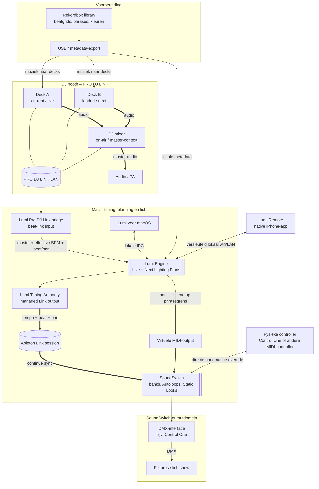
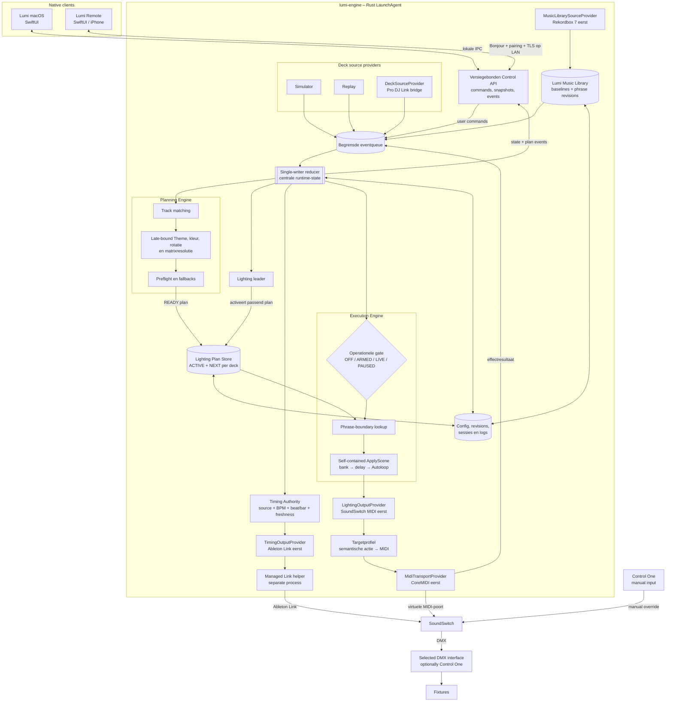
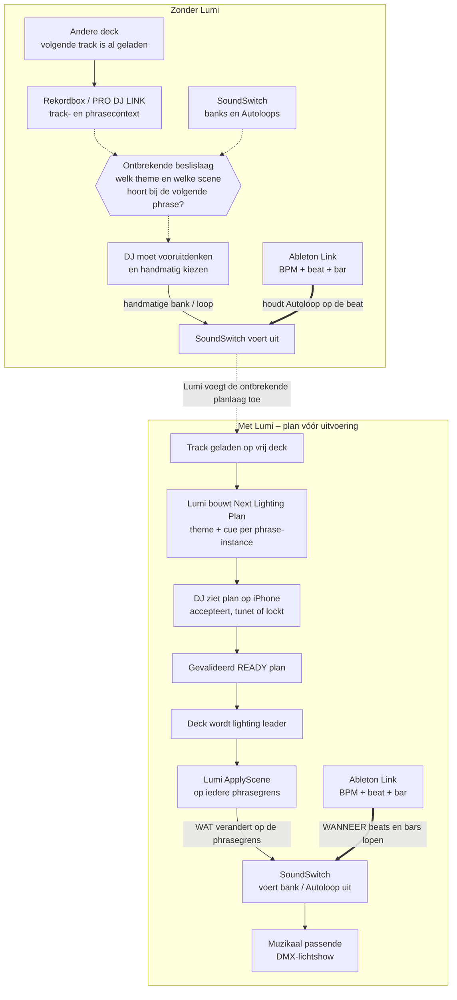

# Lumi – functionele architectuurplaten

Status: **Accepted baseline**
Datum: **2026-08-02**

Deze platen tonen achtereenvolgens het totale DJ- en lichtlandschap, de interne
werking van Lumi en het functionele gat dat Lumi invult.

## Plaat 1 – Totale oplossing

De drie inputs naar SoundSwitch zijn parallel:

- **Ableton Link** houdt BPM, beat en bar continu gelijk met de PRO DJ LINK-
  spelers;
- **Lumi MIDI** kiest op phrasegrenzen welke bank, Autoloop of gemanagede Static
  Look SoundSwitch moet uitvoeren.
- **Control One** blijft een onafhankelijke handmatige gebruikersinput die Lumi
  tijdelijk kan overrulen.

DMX-interface en fixtures vallen volledig binnen het SoundSwitch-domein. Lumi
hoeft niet te weten of de DMX-output via Control One of een andere interface
loopt.

## Plaat 2 – Lumi specifiek

De Music Library bewaart een eigen versioned phrase-timeline nadat een
source-adapter de eerste baseline heeft geleverd. De Planning Engine bindt het
Theme pas per geladen track en doet het creatieve werk vooraf. De Execution
Engine voert in `LIVE` alleen een reeds gevalideerde cue uit. UI's,
source-adapters en outputproviders muteren nooit rechtstreeks de centrale state.
USB media, Pro DJ Link en SoundSwitch zijn eerste providerimplementaties en geen
dependencies van de corecontracten.

## Plaat 3 – De Lumi-usecase: het ontbrekende stuk

Ableton Link lost de continue synchronisatie op, maar kent de trackstructuur en
creatieve intentie niet. SoundSwitch bezit de lichtcontent, maar plant niet
vooruit op de geladen Rekordbox-track. Lumi verbindt precies die twee domeinen:
het plant **wat** straks moet spelen en laat SoundSwitch via zijn bestaande Link-
sync bepalen **hoe** dat exact op de beat blijft lopen.

## Technische bronbasis

- [Ableton Link – concepts and API](https://ableton.github.io/link/)
- [Carabiner – local Ableton Link bridge](https://github.com/Deep-Symmetry/carabiner)
- [beat-link – Pro DJ Link input library](https://github.com/Deep-Symmetry/beat-link)
- [SoundSwitch – Ableton Link](https://support.soundswitch.com/en/support/solutions/articles/69000847102-soundswitch-utilizing-ableton-link-with-soundswitch)
- [SoundSwitch – Autoloops](https://support.soundswitch.com/en/support/solutions/articles/69000847100-soundswitch-autoloops-explained)
