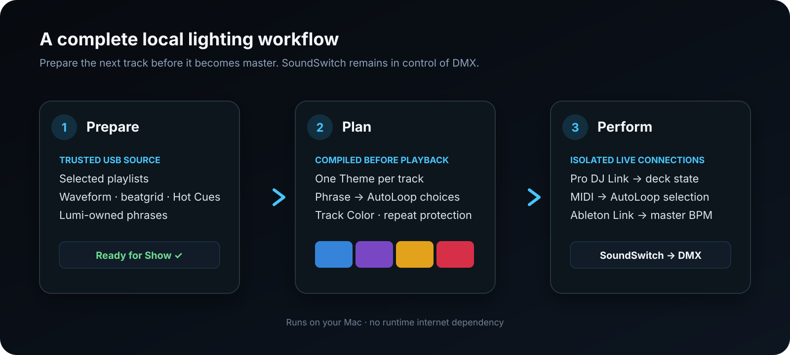
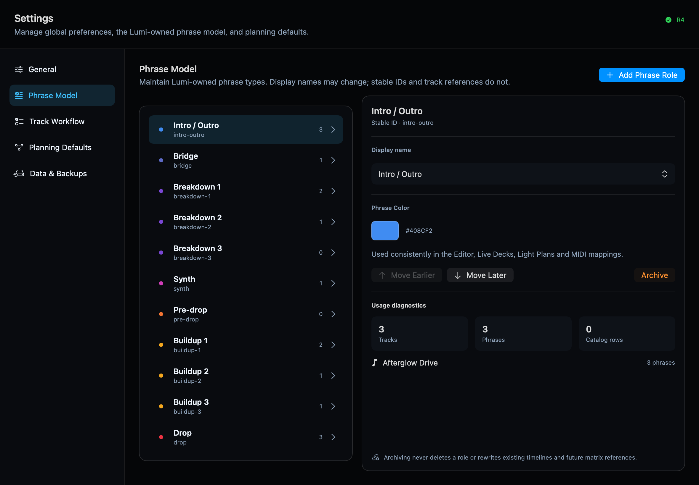

  

# Lumi

## Your lighting plan, ready before the next track starts

Lumi is a native macOS app that turns track structure into a prepared lighting
plan. It watches the current and next deck, follows phrase changes and triggers
your own SoundSwitch AutoLoops without taking over fixture or DMX control.

[Download Lumi](https://github.com/victorblanco-tech/lumi/releases) ·
[Read the user guide](user-guide/) ·
[Report an issue](https://github.com/victorblanco-tech/lumi/issues)

## Prepare once, adjust when needed

1. Synchronize selected playlists from trusted rekordbox OneLibrary USB media.
2. Check the waveform and beatgrid, then create the phrases that matter to your
   lighting workflow.
3. Connect those phrase roles to your own SoundSwitch Banks and AutoLoops.
4. Let Lumi compile a varied full-track Light Plan before playback.
5. Keep the automatic plan or adjust a future Theme or AutoLoop from Live view.

## Built for the booth

- **Current and next deck:** both tracks stay visible, with phrases and planned
  lighting below the waveform.
- **Predictable output:** Lumi sends button-like MIDI actions at phrase changes;
  it does not continuously control the SoundSwitch timeline.
- **Works beside Control One:** manual operator choices and Lumi can coexist.
- **Runs locally:** no internet dependency during preparation or a show.
- **Dry-run mode:** Local Playback lets you prepare and test without decks.

## Clear integration boundaries

- **Pro DJ Link** supplies read-only player and mixer state.
- **Ableton Link** relays only the master BPM to SoundSwitch.
- **MIDI output** selects mapped Banks, AutoLoops and verified Static Looks.
- **SoundSwitch** remains responsible for fixtures, effects and DMX output.

## One phrase language throughout Lumi

Phrase Roles and their colors are yours to configure. The same model is used
consistently in Track Editor, Live, Light Plans and output mappings.

## System requirements

- Apple Silicon Mac running macOS 15 or newer
- rekordbox OneLibrary USB media
- SoundSwitch with MIDI input
- Pro DJ Link-compatible players for Live Decks

The current reference setup uses CDJ-1500X players, a DJM-V5, SoundSwitch,
Control One and a DMX lighting rig. Test every release with your own hardware and
show file before live use.

Continue with the [complete user guide](user-guide/).

---

Lumi is an independent project and is not affiliated with AlphaTheta,
rekordbox, inMusic or SoundSwitch. Source code is licensed under EPL-2.0; names
and branding are covered separately by the project trademark notice.
