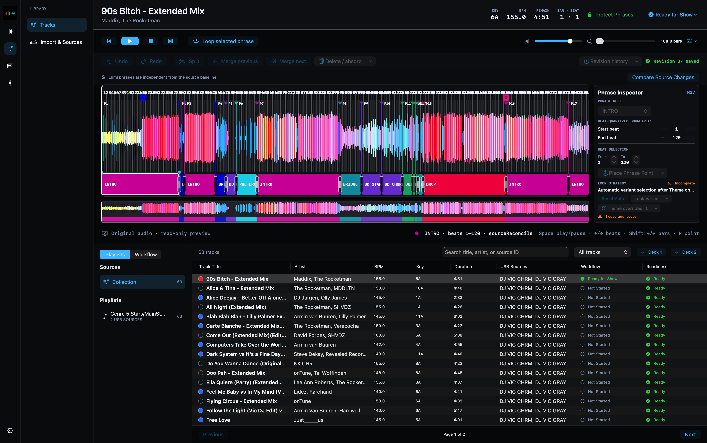
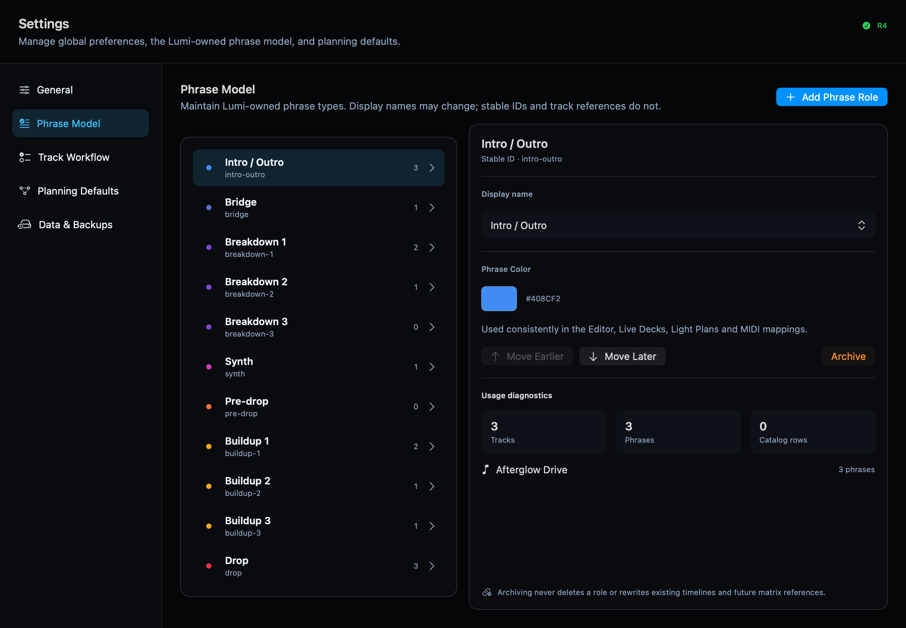
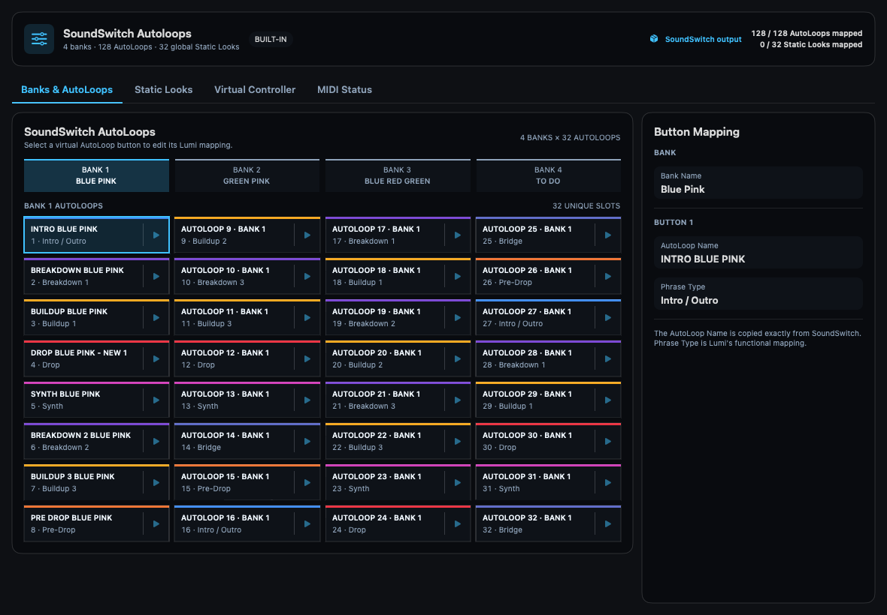
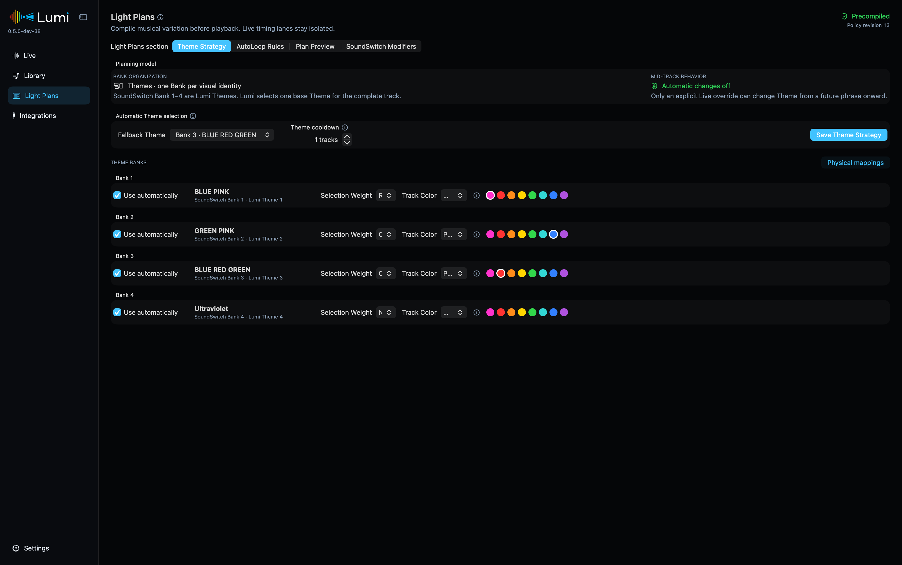
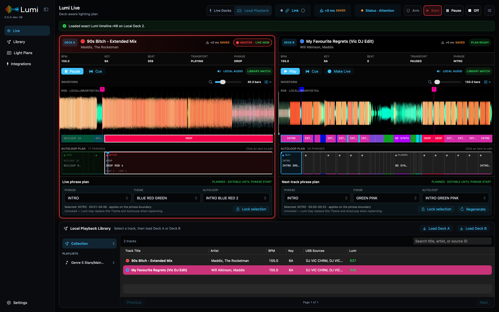

# Lumi user guide

Lumi prepares and runs phrase-aware SoundSwitch lighting for the track that is
playing and the track that is coming next. This guide covers the shortest path
from an empty Lumi library to a working local or Pro DJ Link show.

## Before you start

You need:

- an Apple Silicon Mac running macOS 15 or newer;
- a rekordbox OneLibrary USB source containing analyzed tracks;
- SoundSwitch with MIDI input enabled;
- Pro DJ Link-compatible players for Live Decks.

Local Playback, Track Editor and Light Plan preview work without players. Lumi
runs locally and does not need internet access during normal use.

### Live-show network limitation in 0.6.4

The validated reference setup uses Ethernet, Wi-Fi off and the macOS application
firewall temporarily off. Firewall-enabled reception showed timing delays on
the reference Mac; Wi-Fi and firewall-on timing are not yet accepted for shows.
This is a temporary limitation, not a general claim that firewalls cannot handle
DJ traffic. Only choose the workaround on a trusted, preferably isolated DJ
network, never a public/untrusted network. An uplink means the network is not
isolated. Restore the firewall after the show. Lumi never changes it for you.
See the [0.6.4 release notes](../release/0.6.4-release-notes.md).

To exercise Live Decks without physical players, use the separate
[Pro DJ Link Simulator](pro-dj-link-simulator.md) on another Mac. It supports
two Players, track loops and playlist-driven Auto Mix for longer tests.

## 1. Install Lumi

1. Download the DMG and matching SHA-256 checksum from
   [GitHub Releases](https://github.com/victorblanco-tech/lumi/releases).
2. Compare the downloaded DMG checksum with the published checksum.
3. Finish any active show and quit Lumi. Open the DMG, double-click
   **Install Lumi.pkg** and follow macOS Installer. It creates the right folder;
   no dragging or manual folder setup is needed. Administrator approval may be required.
4. Eject the DMG and open Lumi from `/Applications/Lumi`.
5. If macOS blocks the unsigned installer or app, open **System Settings → Privacy &
   Security**, choose **Open Anyway**, then confirm **Open**.

Production, RC and Dev builds can coexist. They use separate applications,
preferences and databases:

An update replaces only the selected channel's app. Your library, phrases,
MIDI mappings and settings remain in place. Licenses, corresponding source
archives and build information are in **Licenses & Sources** inside the DMG.

| Channel | Installation folder |
| --- | --- |
| Production | `/Applications/Lumi/Lumi.app` |
| RC | `/Applications/Lumi/RC/` |
| Dev | `/Applications/Lumi/Dev/` |

Only download a build from the official Lumi repository. The public build is
currently distributed outside the Mac App Store and is not Apple-notarized.

## 2. Synchronize a trusted USB source

Open **Library → Import & Sources**.

1. Choose **Add USB Source** and select a mounted rekordbox OneLibrary USB.
2. Let Lumi scan the source. The scan is read-only.
3. Expand the source and select only the playlists you want in Lumi.
4. Review the impact counts and any track-level differences.
5. Synchronize the selected playlists.

Lumi remembers each physical USB source independently, including two media
devices with the same make and model. Reconnecting a trusted source refreshes
its status without merging its identity with another device.

On a writable USB, registration can create a tiny `.lumi-media.json` file with
Lumi's versioned media identity. It contains no music, phrases or credentials.
Rekordbox databases and analysis files are never modified. A read-only USB can
still be scanned; unavailable or ambiguous identity is reported rather than
silently treating two devices as one.

Scan counts are an initial comparison. Synchronization verifies the selected
audio and analysis revisions before committing; changed source files require a
fresh scan. Wait for the source's completion report before ejecting the USB.
If a playlist was moved to another folder in rekordbox, select its new location
again rather than assuming the old numeric playlist ID still identifies it.

In Tracks/Editor and the Local Playback library, open folders to browse your
synced playlists. Selecting a playlist filters the track list; opening or closing
a folder does not change the selected tracks. Only synced playlists appear here.
For USBs synced by an older Lumi version, scan each USB once to restore its exact
folder structure. That scan does not import tracks; the structure is then kept
when the USB is disconnected. A `/` inside a name is not treated as a new folder.

When a track differs from the Lumi copy, the review view shows the evidence Lumi
can compare: file data, beatgrid, waveform, Hot Cues and source phrases. Choose
whether to ignore that revision, keep it out of Lumi or replace the Lumi source
data. Lumi-owned phrases remain separate from source phrases.

If a track has an invalid beatgrid, Lumi skips that track and synchronizes the
other valid tracks. The USB source lists the skipped track by name. An existing
Lumi version is retained; a new track without a valid grid is not imported.
Repair its beatgrid in rekordbox, export to USB and sync again. Lumi never
invents beats to work around invalid source data.

> A USB beatgrid or audio revision can invalidate earlier phrase alignment.
> Review changed tracks before a show.

## 3. Prepare tracks

Open **Library → Tracks** and select a track to load it in Track Editor.

The detailed waveform is the editing surface. Zoom and scroll to a beat, place a
phrase point and choose its Phrase Role. A phrase continues until the next point
or the end of the track. Boundaries quantize to whole beats.

Use the preparation workflow beside Playlists to keep work organized:

- **Not Started** and **In Progress** collect unfinished tracks.
- **Ready for Show** marks a checked track with a green status.
- **Changed after USB sync** contains prepared tracks whose source analysis
  changed and needs another review.
- **Protect Phrases** prevents accidental Lumi phrase edits or replacement;
  intentional USB beatgrid, waveform and cue updates can still be reviewed.

Workflow steps and Phrase Role colors can be adjusted in **Settings**. The same
phrase colors are used throughout Library, Live, Light Plans and mappings.

### Save lighting choices in Track Editor

Choose **Track Theme** above the waveform to save a Theme for the whole track.
Choose **Automatic · Light Plans** to return to automatic Theme selection.
These are library preferences, not temporary live-session changes.

Select a phrase and use **Phrase AutoLoop** in its inspector to save a specific
AutoLoop. The list only contains mappings for that phrase's role within the
selected Track Theme. Other phrases remain automatic within the same Theme.
Changing the Track Theme does not bring AutoLoops from another Theme into it.
Protected tracks must be unlocked before changing these choices.

## 4. Configure SoundSwitch output

Open **Integrations → Lighting Outputs**.

### Banks and AutoLoops

Lumi treats the four SoundSwitch Banks as four physical collections of 32
AutoLoop slots. Name each Bank and each AutoLoop exactly as you recognize them
in your SoundSwitch show.

Use **Virtual Controller** for MIDI learn:

1. Start Lumi's virtual MIDI source.
2. In SoundSwitch, enable MIDI learn for the target Bank or AutoLoop button.
3. Send the matching Lumi learn pulse.
4. Finish MIDI learn in SoundSwitch.
5. Use the per-slot test action to confirm that the correct button responds.

Map every Bank and AutoLoop to its own MIDI address. Mapping one address across
several Banks makes SoundSwitch respond ambiguously.

### Static Looks

Static Looks use the same guided learn and test workflow. SoundSwitch exposes 32
global slots. A verified look can be included in a Light Plan, and Lumi changes
it only when the compiled desired look changes. Automatic execution stays off
for an unverified mapping.

Only one mapped Static Look is expected to be active at a time in the current
SoundSwitch workflow.

## 5. Configure Light Plans

Open **Light Plans**.

The main concept is simple: Lumi chooses one SoundSwitch Bank as the base
**Theme** for a track, then selects AutoLoops from that Theme for each Phrase
Role. Automatic phrase changes do not jump between Themes. You can deliberately
override a future phrase from Live view.

For each Theme you can configure:

- its user-facing name;
- whether it is eligible for automatic planning;
- its selection weight;
- Track Color behavior: **Neutral**, **Prefer** or **Only**;
- the Phrase Roles and AutoLoops available in that Theme.

Repeat protection considers recent tracks and the already reserved next-track
plan. This avoids using the same Theme for every consecutive track. If all valid
Themes are inside the cooldown, Lumi relaxes the restriction deterministically
instead of producing no plan.

Use **Automatic Plan Preview** before a show. It displays the chosen Theme,
selection reason and complete phrase-to-AutoLoop sequence. A Phrase Role without
a valid mapping is a visible no-op: Lumi leaves the active AutoLoop running and
does not silently choose a different role or Theme.

Track Color is optional. Tracks without a color can still use eligible Neutral
and Prefer Themes.

## 6. Connect the live integrations

Open **Integrations** and check three independent lanes:

- **Pro DJ Link** discovers compatible players and mixers and supplies deck
  state. Lumi listens read-only and does not control a player.
- **Ableton Link** sends the current master BPM to SoundSwitch. It does not carry
  phrases or lighting commands.
- **Lighting Output** sends mapped MIDI button actions to SoundSwitch. It does
  not control the SoundSwitch playback timeline.

SoundSwitch should show one Ableton Link peer when Lumi's Link relay is enabled.
Choose the Lumi MIDI source as SoundSwitch's MIDI input. Your physical Control
One can remain connected and usable beside Lumi.

### Service controls (next development release)

**Settings → Services** shows whether Lumi's engine and Remote service are
responding. Expand **Process details** to see their macOS process IDs and app
paths. **Stop** disconnects Remote and stops Lumi's output; **Start** brings
the services back, and **Restart** does both in order. Your library and mappings
are preserved. The saved Ableton Link auto-start preference also applies to
explicit service starts. Lighting still starts in **Off**: arm and start the
show deliberately.

Quitting Lumi stops its services and Link helper before the app closes. If a
service cannot be stopped, Lumi stays open and reports the problem instead of
silently leaving it behind. Restart interrupts lighting output, so use it only
when it is safe to do so.

## 7. Run a show

Open **Live** and choose a mode:

- **Live Decks** follows the players discovered through Pro DJ Link.
- **Local Playback** loads tracks from the Lumi Library for preparation and dry
  runs.

The two deck surfaces show the actual waveform, Hot Cues, Lumi phrases and the
compiled AutoLoop plan. The master moves between Player 1 and Player 2 with the
DJ setup. A loaded non-master track can be reviewed and adjusted before it
becomes live.

### Operation states

| State | Behavior |
| --- | --- |
| **Off** | No show output. |
| **Arm** | Read decks and compile plans, but send no lighting MIDI. |
| **Start** | Send the planned Bank, AutoLoop and verified Static Look actions. |
| **Pause** | Keep state visible, but suspend new automatic lighting actions. |

For the start of a set, load and cue the first track, choose **Arm**, then
**Start**. When playback begins, Lumi selects the phrase at the actual landing
position and triggers its prepared lighting action. Hot Cues and Beat Jumps are
treated as transport changes: the old forecast is discarded and the landing
phrase becomes authoritative.

You can change the Theme or AutoLoop for a future phrase until that phrase has
started. Changes to the currently active or completed phrase are intentionally
locked.

### Lighting timing offset

**Available in Lumi 0.6.4 (Remote controls require 0.1.3 or newer).** The timing panel
also offers **Initial show start**. **Immediate** preserves the normal behavior.
**On phrase start** waits for the next executable phrase boundary after Start.
Cue a few beats before that boundary to give Lumi time to prepare the bank and
scheduled AutoLoop. The Live timing control shows the target phrase and beats
remaining. This is only an initial run-in; subsequent phrase changes and Hot Cues
continue normally. The choice is saved on the Mac and shared with Remote.
Change it in **Off** or **Arm**, never during a running show. If no future phrase
is available, Lumi says so: return to Off and choose Immediate or cue earlier.
This does not reset Ableton Link or continuously correct SoundSwitch playback.

The subtle timing control in Live compensates for a consistent delay in the
SoundSwitch, MIDI or fixture chain:

- a **negative** value sends the action earlier;
- a **positive** value sends the action later;
- `0 ms` uses the measured phrase boundary.

Adjust this only after testing the complete output chain. A change during a show
becomes active at the next phrase boundary, so it cannot disturb the AutoLoop
that is already running.

## 8. Back up and rebuild safely

Use Lumi's data tools before a release upgrade or major library cleanup. Keep
separate backups for:

- the Track Library and source analysis;
- Lumi phrases and preparation state;
- configuration, Phrase Roles and workflow;
- Lighting Outputs and Light Plans.

A clean library rebuild can remove imported tracks while preserving creative
phrase data and output configuration. When a new edit or mashup replaces an old
track, Lumi can propose phrase reuse only when the total beat count matches
exactly. It does not stretch or guess phrase boundaries.

## Troubleshooting

### A track is not recognized on a live player

- Confirm that the USB source used by the player is trusted and synchronized.
- Refresh the source and check the track-level impact or review state.
- With Strict USB Matching enabled, synchronize every USB source you use during
  the show.
- Confirm that the current audio revision, beatgrid and source identity match
  the Lumi Library.

### A track has no Light Plan

- Check that it has valid Lumi phrases.
- Confirm that the selected Theme has an exact mapping for the opening Phrase
  Role.
- Check Theme eligibility, Track Color `Only` rules and verified output slots.
- Open Automatic Plan Preview for the exact selection reason.

### SoundSwitch receives BPM but no AutoLoops

- Confirm that Live operation is **Start**, not **Arm** or **Pause**.
- Check that the virtual MIDI source is running and selected in SoundSwitch.
- Test the intended Bank and AutoLoop slots from Lighting Outputs.
- BPM and AutoLoop output are separate integrations; a green Link connection
  does not prove MIDI mapping.
- A ready Lighting Output means Lumi's MIDI sender is available. SoundSwitch
  does not acknowledge that an AutoLoop has actually started; verify its selected
  loop and visible progress as part of your pre-show check.

### SoundSwitch stops responding

Put Lumi in **Off** and check SoundSwitch itself. A surviving Link connection
does not prove that SoundSwitch's user interface or lighting playback is
healthy. Avoid repeatedly restarting Lumi to force recovery. Save your work if
SoundSwitch still permits it, then restart SoundSwitch and verify a mapped
AutoLoop before returning to **Start**. Include whether Control One was connected
and whether a MIDI device or service had just appeared or disappeared when
reporting the hang.

### macOS blocks or cannot open Lumi

- Confirm that the Mac is Apple Silicon and runs macOS 15 or newer.
- Download the DMG again from the official release and verify its checksum.
- Repeat the **System Settings → Privacy & Security → Open Anyway** step.

### Before reporting an issue

Record the Lumi version, macOS version, player/mixer models, SoundSwitch version
and the smallest reproducible sequence. Do not attach music, USB databases,
SoundSwitch projects, tokens or other private data to a public issue.

Report reproducible problems through
[GitHub Issues](https://github.com/victorblanco-tech/lumi/issues).

## Bulk USB review

In a USB source's **Tracks to review** section, select individual tracks or choose **Select all**. **Keep Lumi** saves that decision for each exact USB revision; a later change can appear for review again. **Use USB Version…** asks for confirmation before replacing imported Rekordbox components. Lumi-authored phrases and AutoLoop choices remain protected.

Reviews are processed one at a time with the existing revision checks. If a track fails validation, processing stops; already completed choices remain saved and remaining items can be reviewed again.
