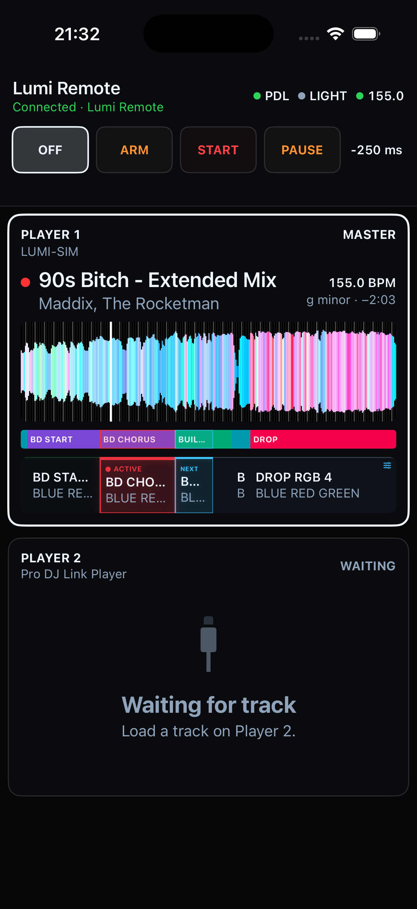

# Lumi Remote for iPhone

Lumi Remote is the focused Live Decks companion for the booth. The Mac remains
the show authority; the iPhone displays its current state and sends a small,
revision-safe set of user commands.

## Requirements

- Lumi Remote 0.1.0 or newer on an iPhone running iOS 18 or newer;
- Lumi 0.6.0 or newer on an Apple Silicon Mac;
- both devices on the same local network;
- matching Production, RC or Dev release channels.

The phone needs Local Network permission. Internet access is not required while
using the Remote. A TestFlight invitation is the supported public-beta install
path once it is published; a Simulator archive from GitHub Releases cannot be
installed on a physical iPhone.

## Pair the iPhone

1. On the Mac, open **Integrations → iPhone Remote** and enable the Remote
   Gateway.
2. Choose **Pair New iPhone**. Lumi shows a one-use QR code and confirmation
   code that expire after five minutes.
3. Open the iPhone Camera, scan the QR code and continue in Lumi Remote.
4. Confirm that the six-digit code is identical on the Mac and iPhone.
5. Approve the device on the Mac and grant **Controller** access when this phone
   should be allowed to change the show.

The iPhone stores its credential in Keychain. The Mac stores only a verifier.
Pairing can be revoked or Controller access transferred from the same
Integration page.

## Live controls

The top bar stays visible during connection, reconnect and playback. It shows
Pro DJ Link, Light Output and Ableton Link health plus the current master BPM.
The main controls mirror macOS:

- **Off** stops automatic lighting output;
- **Arm** follows Players and prepares plans without sending lighting actions;
- **Start** allows the Mac engine to send the prepared lighting actions;
- **Pause** suspends new automatic actions while retaining show state;
- **Link** enables or disables the isolated Ableton Link relay;
- **Timing offset** changes the saved lighting compensation for a future phrase
  boundary without disturbing the AutoLoop that is already running.

Only one paired iPhone can be Controller at a time. Viewers see the same Live
state but cannot mutate it. Commands are never queued while disconnected.

## Player view

Portrait places the Master first and the prepared next Player below it.
Landscape keeps numbered Players side by side. Each loaded card contains:

- the real `Player n` identity and detected hardware model;
- title, artist, track color, effective BPM, key and remaining time;
- the same cached RGB waveform, beatgrid and Hot Cue markers used by Lumi;
- a fixed Master playhead with a default 40-bar viewport;
- proportional Lumi phrases and the compiled Light Plan;
- clear red **Active** and blue **Next** plan emphasis.

Pinch changes the visible beat span without moving the Master playhead. Tapping
a future phrase opens Theme, AutoLoop and lock controls. Active and completed
phrases remain read-only.

## Connection safety

The Remote Gateway is deliberately outside the three realtime integrations.
Closing the iPhone app, losing Wi-Fi or revoking a device cannot stop Pro DJ
Link ingestion, SoundSwitch MIDI output or Ableton Link on the Mac. On return,
the app reconnects and requests a complete current snapshot before enabling
controls.

If connection fails:

1. confirm that both devices are on the same LAN and not isolated by a guest
   Wi-Fi policy;
2. confirm that the matching Remote Gateway is enabled on the Mac;
3. check iOS **Settings → Privacy & Security → Local Network**;
4. keep the last show running on the Mac and reconnect the phone—do not re-pair
   unless Lumi reports that the credential was revoked.

## Beta feedback

Include the Lumi and Lumi Remote versions, iPhone model, iOS version, Mac model,
network type and smallest reproducible sequence in a field report. Never attach
music, USB databases, SoundSwitch projects, pairing QR codes, tokens or private
network details to a public issue.

See [Privacy](../privacy.md) and the [Public Beta guide](../public-beta.md).
