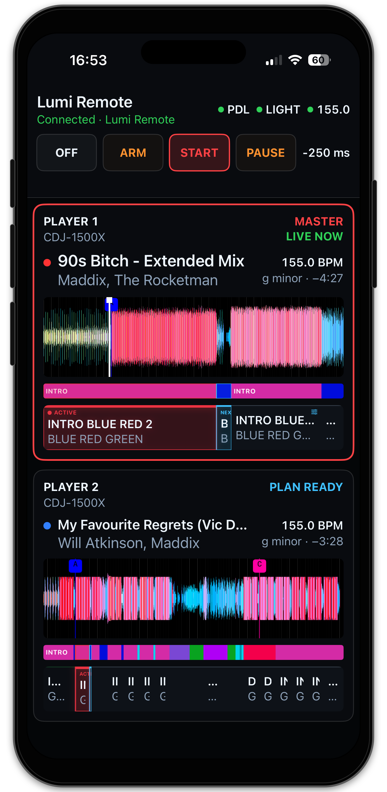

# Lumi Remote for iPhone

Lumi Remote is the focused Live Decks companion for the booth. The Mac remains
the show authority; the iPhone displays its current state and sends a small,
revision-safe set of user commands.

<p align="center">
  
</p>

## Requirements

- Lumi Remote 0.1.0 or newer on an iPhone running iOS 18 or newer;
- Lumi 0.6.0 or newer on an Apple Silicon Mac;
- both devices on the same local network;
- matching Production, RC or Dev release channels.

The phone needs Local Network permission. Internet access is not required while
using the Remote. The current beta is installed from source with Xcode. A
Simulator archive from GitHub Releases cannot be installed on a physical
iPhone, and no TestFlight invitation is currently available.

## Install the current beta with Xcode

This is the free installation route while Lumi Remote is in its early public
beta. It requires a Mac and an Apple Account, but it does not require a paid
Apple Developer Program membership.

1. Install the current Xcode release from the Mac App Store.
2. Clone Lumi and switch to the immutable Remote beta tag:

   ```bash
   git clone https://github.com/victorblanco-tech/lumi.git
   cd lumi
   git switch --detach lumi-remote-v0.1.0
   open apps/ios/LumiRemote.xcodeproj
   ```

3. Choose **Product → Scheme → Edit Scheme**, select **Run** and set its build
   configuration to **Release**. This connects to the Production Lumi Gateway.
4. In Xcode, open **Xcode → Settings → Accounts** and add your Apple Account.
5. Select the **LumiRemote** project and target, then open **Signing &
   Capabilities**.
6. Enable **Automatically manage signing**, select your **Personal Team** and
   replace the Release bundle identifier with a unique value such as
   `local.yourname.lumi.remote` if Xcode reports that the existing one is
   unavailable.
7. Connect and unlock the iPhone, trust the Mac when asked and enable
   **Settings → Privacy & Security → Developer Mode** on the iPhone if needed.
8. Select that iPhone as the Xcode run destination and press **Run**.
9. Start **Lumi 0.6.0** on the Mac, enable its Remote Gateway and follow
   the pairing steps below.

Apple Personal Team provisioning expires after seven days. Reconnect the
iPhone and press **Run** in Xcode again to renew the installation. Apple also
limits free on-device testing to three devices per platform. Do not download or
install an IPA offered by an unofficial third party.

Production, RC and Dev Remotes cannot cross-connect. The Release configuration
above deliberately pairs with the Production Mac app. TestFlight will become
the preferred public installation path if the project gains enough field usage
to justify the paid Apple Developer Program membership.

## Pair the iPhone

1. On the Mac, open **Integrations → iPhone Remote** and enable the Remote
   Gateway.
2. Choose **Pair New iPhone**. Lumi shows a one-use QR code and confirmation
   code that expire after five minutes.
3. Open the iPhone Camera, scan the QR code and continue in Lumi Remote.
4. Confirm that the six-digit code is identical on the Mac and iPhone.
5. Approve the device on the Mac and grant **Controller** access when this phone
   should be allowed to change the show.

The iPhone stores its credential in Keychain. The Mac stores only a verifier.
Pairing can be revoked or Controller access transferred from the same
Integration page.

## Live controls

The top bar stays visible during connection, reconnect and playback. It shows
Pro DJ Link, Light Output and Ableton Link health plus the current master BPM.
The main controls mirror macOS:

- **Off** stops automatic lighting output;
- **Arm** follows Players and prepares plans without sending lighting actions;
- **Start** allows the Mac engine to send the prepared lighting actions;
- **Pause** suspends new automatic actions while retaining show state;
- **Link** enables or disables the isolated Ableton Link relay;
- **Timing offset** changes the session lighting compensation for a future phrase
  boundary without disturbing the AutoLoop that is already running.

Tap the timing value to adjust it from **−250 to +250 ms**, with a slider and
1 ms fine adjustment. Negative values trigger earlier; positive values trigger
later. **Apply** sends your choice; **Cancel** leaves it unchanged. During
playback, **NEXT PHRASE** appears beside the requested value until the engine
applies it at a phrase boundary. Incoming player updates do not reset an open
timing editor.
This requires Lumi 0.6.2-dev-7 / Remote 0.1.1-dev-4 or newer. The Mac's saved
default still applies when Lumi starts again.

Only one paired iPhone can be Controller at a time. Viewers see the same Live
state but cannot mutate it. Commands are never queued while disconnected.

With Lumi 0.6.2 / Remote 0.1.1 or newer, the connected status explicitly says
**Controller** or **View only**. Both are healthy connections. Tap the Lumi
Remote heading for the controlling device and this app's version. An older
Remote that does not report its version is shown as such on the Mac.

The Controller keeps its role while offline. Opening another Remote, restarting
the Gateway or changing show mode does not transfer control. To hand over,
choose **Make Controller** for the desired device in **Integrations → iPhone
Remote** on the Mac. **Revoke** removes the pairing; it does not assign another
Controller automatically. The first paired device receives control initially.
The Mac's **Control history** records initial assignment, explicit transfers
and Controller revocation. Entries begin with this update, not retrospectively.

## Player view

Portrait places the Master first and the prepared next Player below it.
Landscape keeps numbered Players side by side. Each loaded card contains:

- the real `Player n` identity and detected hardware model;
- title, artist, track color, effective BPM, key and remaining time;
- the same cached RGB waveform, beatgrid and Hot Cue markers used by Lumi;
- proportional Lumi phrases and the compiled Light Plan;
- clear red **Active** and blue **Next** plan emphasis.

Pinch changes the visible beat span without moving the Master playhead. Tapping
a future phrase opens Theme, AutoLoop and lock controls. Active and completed
phrases remain read-only.

## Connection safety

The Remote Gateway is deliberately outside the three realtime integrations.
Closing the iPhone app, losing Wi-Fi or revoking a device cannot stop Pro DJ
Link ingestion, SoundSwitch MIDI output or Ableton Link on the Mac. On return,
the app reconnects and requests a complete current snapshot before enabling
controls.

If connection fails:

1. confirm that both devices are on the same LAN and not isolated by a guest
   Wi-Fi policy;
2. confirm that the matching Remote Gateway is enabled on the Mac;
3. check iOS **Settings → Privacy & Security → Local Network**;
4. keep the last show running on the Mac and reconnect the phone—do not re-pair
   unless Lumi reports that the credential was revoked.

## Beta feedback

Include the Lumi and Lumi Remote versions, iPhone model, iOS version, Mac model,
network type and smallest reproducible sequence in a field report. Never attach
music, USB databases, SoundSwitch projects, pairing QR codes, tokens or private
network details to a public issue.

See [Privacy](../privacy.md) and the [Public Beta guide](../public-beta.md).
